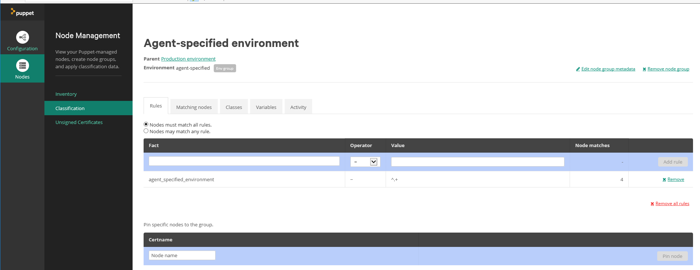
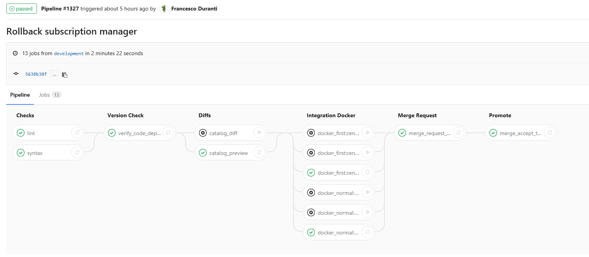
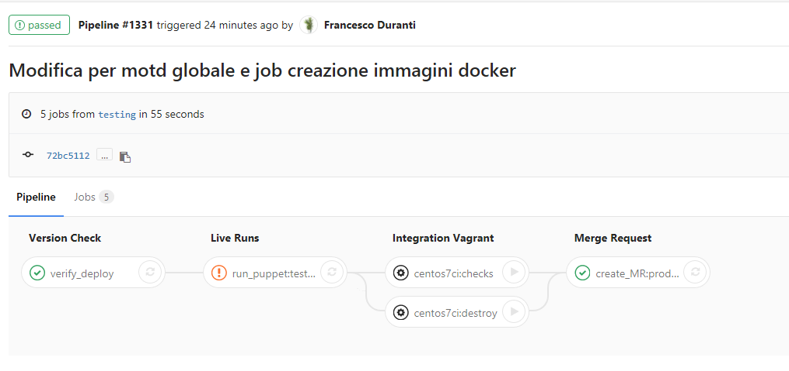
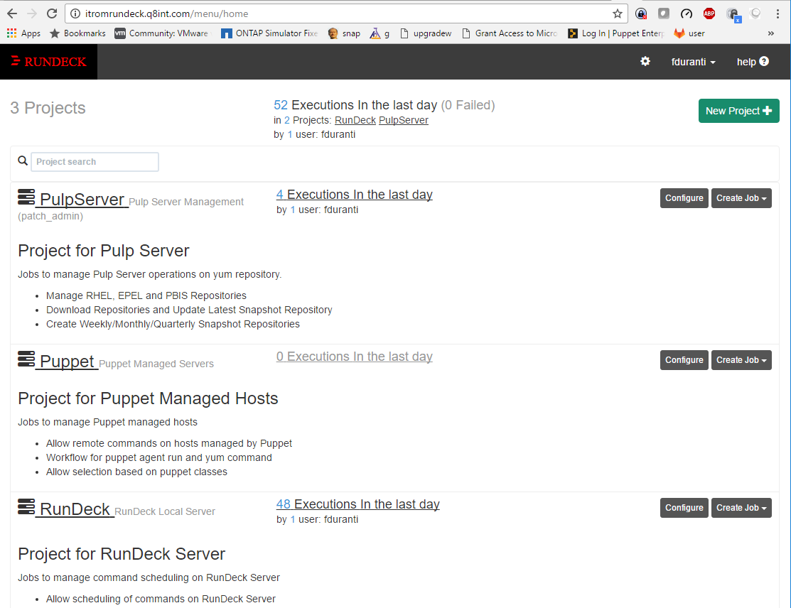
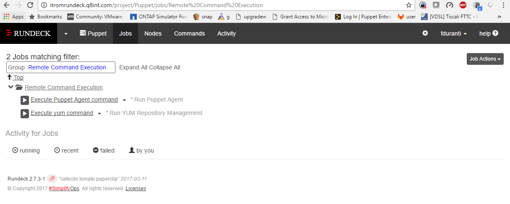
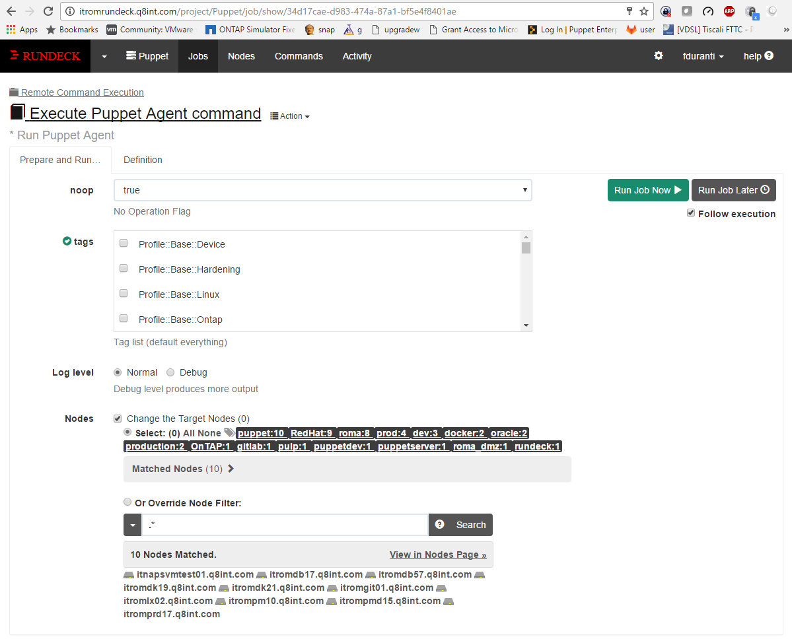
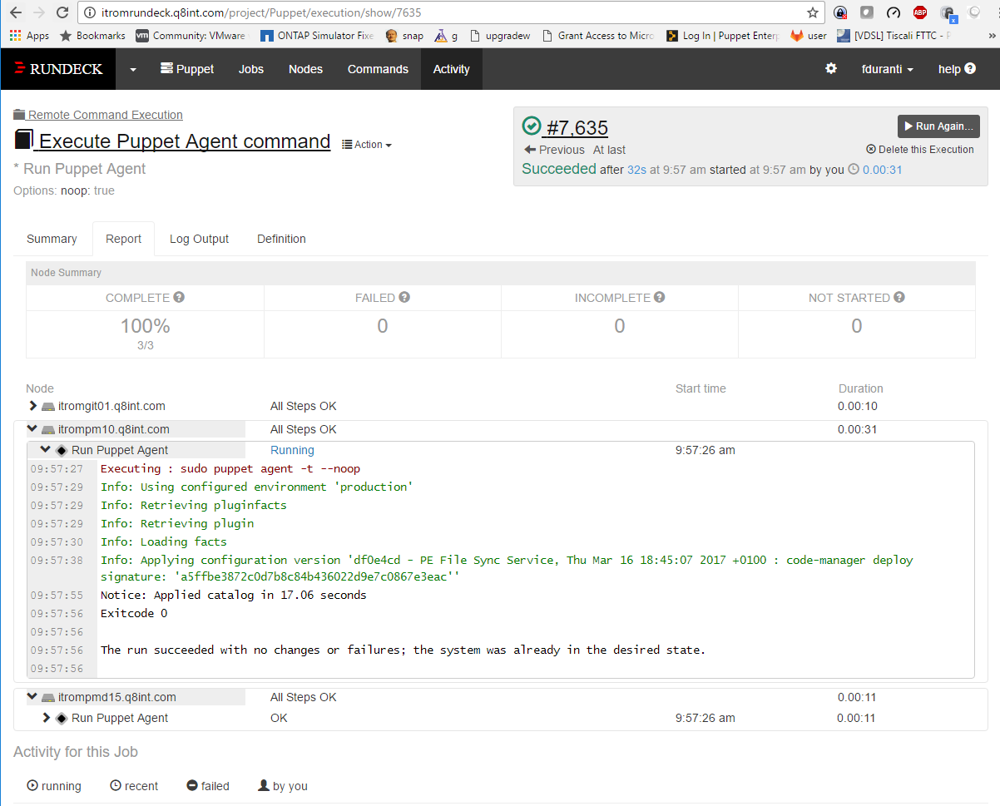

# Puppet Control-repo documentation

This Puppet control repo contains all the resources needed to fully manage our infrastructure with Puppet:

  - Local Puppet code in ```site/``` directory
  - Local Puppet data in ```data/``` directory
  - References to the external modules to use in ```Puppetfile```
  - Support scripts and tools in ```bin/``` directory
  - Vagrant environments for testing in ```vagrant/``` directory
  - Continuous Integration on GitLab defined in ```.gitlab-ci.yml```

## Documentation

General Puppet documentation:

  - [Introduction to Puppet](README.md#introduction) - A very basic introduction to Puppet

  - [Hiera essentials](README.md#hiera) - Basic Hiera concepts

  - [Hiera eyaml](README.md#hieraeyaml) - An overview on how to use hiera-eyaml

  - [Trusted Facts](README.md#trustedfacts) - How to set and use trusted facts

  - [External Facts](README.md#externalfacts) - How to set and use external facts

  - [Noop Mode](README.md#noop) - An overview on how to enforce noop mode server side with this repo


About this control-repo:

  - [Using and understanding the control-repo](README.md#controlrepo) - An overview of the control-repo and how to understand, use and customise it

  - [Prerequisites](README.md#prerequisites) - A more detailed view of the prerequisites needed to fully use the control-repo

  - [Vagrant Integration](README.md#vagrant) - How to use Vagrant to test the control-repo while deployment

  - [Docker Integration](README.md#docker) - How to use Docker to test Puppet code and to build images based on the existing Puppet code

  - [Fabric](README.md#fabric) - A review of Puppet tasks available with Fabric


Managing changes:

  - [Git tasks](README.md#git) - An overview on how to use Git

  - [Change Process](README.md#change) - A step by step guide on how to manage changes in Puppet code

  - [Profiles](README.md#profiles) - An high level overview of the available Profiles


## <a name="introduction"></a>Introduction to Puppet

Puppet features a declarative Domain Specific Language (DSL), which expresses the desired state and properties of the managed resources.
Resources can be any component of a system, for example, packages to install, services to start, files to manage, users to create, and also custom and specic resources such as MySQL grants, Apache virtual hosts, and so on.
Puppet code is written in **manifests**, which are simple text files with a .pp extension. Resources can be grouped in classes (do not consider them as classes as in OOP; they aren't). Classes and all the files needed to define the required configurations are generally placed in modules, which are directories structured in a standard way that are supposed to manage specific applications or a system's features (there are modules to manage Apache, MySQL, sudo, sysctl, networking, and so on).

When Puppet is executed, it first runs **facter**, a companion application, which gathers a series of variables about the system (the IP address, the hostname, the operating system, the MAC address, and so on), which are called facts, and are sent to the Master.
Facts and user defined variables can be used in manifests to manage how and what resources to provide to the clients.
When the Master receives a connection, then it looks in its manifests (starting from the the files in ```/etc/puppetlabs/code/environments/production/manifests/site.pp```) what resources have to be applied for that client host, also called a node.
The Master parses all the DSL code and produces a **catalog** that is sent back to the client (in the PSON format, which is a JSON variant used in Puppet). The production of the catalog is often referred to as catalog compilation.
Once the client receives the catalog, it starts to apply all the resources declared there, irrespective of whether packages are installed (or removed), services have started, configuration  files are created or changed, and so on. The same catalog can be applied multiple times; if there are changes on a managed resource (for example, a manual modification of a configuration file), they are reverted to the state defined by Puppet; if the system's resources are already at the desired state, nothing happens.
This property is called **idempotence** and is at the root of the Puppet declarative model. Since it defines the desired state of a system, it must operate in a way that ensures that this state is obtained wherever the starting conditions and the number of times Puppet is applied.

### Anatomy of a Puppet run

In normal setups Puppet follows a Client-Server paradigm, on clients it runs, as ```root``` the **Puppet Agent** service, which connects to the **Puppet Master**. All the communication is done using REST-like API calls on an SSL socket; basically, it's all HTTPS traffic from clients to the server's port 8140/TCP.

The first time we execute Puppet on a node, a x509 certificate is created and then the Puppet Master is contacted in order to retrieve the node's catalog. The client's certificate has to be accepted (signed) by the server, using its own local Certification Authority.

A typical Puppet run is composed of different phases. It's important to know them in order to troubleshoot problems:

  - Execute Puppet on the client. On a root shell, run ```puppet agent -t```.

  - Modules' plugins (whatever is present in the ```lib``` dir of a module) are synced to the node. You will see a message like:

        Info: Retrieving plugin

  - The client runs facter and sends its facts to the Master. The client output looks like:

        Info: Loading facts in /var/lib/puppet/lib/facter/... [...]

  - The Master looks for the client's certname in its nodes' list.

  - The Master compiles the catalog for the client using its facts and the Puppet code and data it. On Puppet Master logs an entry like this will be added:

        Compiled catalog for <client> in environment production in 8.22 seconds

  If there are syntax errors in the processed Puppet code, they are exposed here, and the process terminates; otherwise, the server sends the catalog to the client in the PSON format. On the client a text like this will be displayed:

       Info: Caching catalog for <client>

  The client receives the catalog and starts to apply it locally. If there are dependency loops, the catalog can't be applied and the whole run fails. If not the client will start to apply the resources present in the catalog, beginning with a message like:

       Info: Applying configuration version '1355353107'

  - All changes to the system are shown on stdout or in logs. If there are errors they are relevant to specific resources but do not block the application of other resources (unless they depend on the failed ones, in those cases a message mentioning ```Skipping because of failed dependencies``` will be shown.

  - At the end of the Puppet run, the client sends to the server a report of what has been changed. Client output:

       Finished catalog run in 13.78 seconds

  - The server sends the report to a report collector (typically PuppetDB) for storage and later querying.


## <a name="hiera"></a>Hiera

[Hiera](https://docs.puppet.com/hiera/) is Puppet's builtin key/value data lookup system, where we can store the data we use to configure our system. It has some peculiar characteristics:

  - It's hierarchical: We can configure different hierarchies of data sources and these are traversed in order to find the value of the desired key, from the level at the top, to the one at the bottom.
  This is very useful to allow granular configurations of different settings for different groups of servers

  - It has a modular backend system: data can be stored on different places, according to the used plugins, from simple Yaml or Json files, to MongoDb, Mysql, PostgreSQL, Redis and [others](https://voxpupuli.org/plugins/#hiera). In our control-repo we use the [Hiera-eyaml](hiera_eyaml.md) backend which uses plain [Yaml](http://yaml.org) files for data storage and allows encryption of the values of selected keys (typically the ones which contains passwords or secrets)

Hiera is important because it allows to assign values to the parameters of Puppet classes.

A parameter called ```server``` of a class called ```ntp```, for example, can be evaluated via a lookup of the Hiera key ```ntp::server```:

    class ntp (
      String $server = 'ntp.pool.org'
    ) { ... }

Given the above class we can override the default value for the ```server``` parameter of the class ```ntp``` with a similar entry in one of the Yaml files used in Hiera's hierarchies:

    ---
    ntp::server: 'time.nist.gov'

This is useful to cleanly separate our Puppet code, where we declare, inside classes, the resources we want to apply to our nodes, from the data which defines how these resources should be.

In Puppet 4.9, Hiera version 5 has been introduced and this is the version we use in our control-repo.

### Hiera configuration: hiera.yaml

Hiera's configuration file (```hiera.yaml```) has changed format in version 5, here's the default, which uses the core Yaml backend and has only a layer called common:

    ---
    version: 5
    hierarchy:
      - name: Common              # A level of the hierarchy. They can be more using different data sources
        path: common.yaml         # The path of the file, under the datadir, where data is stored
    defaults:
      data_hash: yaml_data        # Use the YAML backend
      datadir: data               # Yaml files are stored in the data dir of your Puppet environment/control-repo

Here's the actual structure of the hiera.yaml file used in this control-repo, it uses the Hiera-eyaml backend and has various levels in its hierarchy:

    ---
    version: 5
    defaults:
      datadir: data
      data_hash: yaml_data
    hierarchy:
      - name: "Eyaml hierarchy"
        lookup_key: eyaml_lookup_key
        paths:
          - "nodes/%{::trusted.certname}.yaml"
          - "roles/%{::pp_application}-%{::pp_role}-%{::pp_environment}.yaml"
          - "roles/%{::pp_application}-%{::pp_role}.yaml"
          - "roles/%{::pp_application}-%{::pp_environment}.yaml"
          - "roles/%{::pp_application}.yaml"
          - "roles/%{::pp_role}.yaml"
          - "locations/%{::pp_datacenter}-%{::pp_zone}.yaml"
          - "locations/%{::pp_datacenter}.yaml"
          - "locations/%{::pp_zone}.yaml"
          - "common.yaml"
          - "defaults.yaml"
        options:
          pkcs7_private_key: /etc/puppetlabs/keys/private_key.pkcs7.pem
          pkcs7_public_key:  /etc/puppetlabs/keys/public_key.pkcs7.pem

The key infos we can get from it are:

  - The eyaml-backend is used (```lookup_key: eyaml_lookup_key```)

  - It's public and private keys are stored in the directory ```/etc/puppetlabs/keys/```. They have to be copied there wherever you run Puppet to compile a catalog which uses encrypted data: typically on the PuppetMaster, on the Vagrant VMs where you use Puppet for local testing during development, and eventually also on the Vagrant VMs used in CI. These keys are not present in this control-repo (otherwise it would defy the whole concept of using encryption to protect sensitive data).

  - The Yaml files containing our Hiera data are placed in the directory data (```datadir: data```) in out control-repo/Puppet environment. So, for example, for production Puppet environment, all the YAML files are under ```/etc/puppetlabs/code/environments/production/data```

  - The hierarchy is based on several ```paths``` under the datadir. Variables are used there (```%{varname}```). Hierarchy goes from the most specific path: ```nodes/%{::trusted.certname}.yaml``` which refers to a specific node to the most generic (```defaults.yaml```) which is used as default value for keys which are not set at higher levels.

For full reference on the format of Hiera 5 configuration file, check the [Official Documentation](https://docs.puppet.com/puppet/latest/hiera_config_yaml_5.html)

### Environment and module data

Hiera 4, used from Puppet versions 4.3 to 4.8, introduced the possibility of defining, inside a module, the default values of each class parameter using Hiera.

The actual user data, outside modules, was configured by a global ```/etc/puppetlabs/puppet/hiera.yaml``` file, which defines Hiera configurations for every Puppet environment.

With Hiera 5 is possible to have environment specific configurations, so we can have a ```hiera.yaml``` inside a environment directory which may be different for each environment (```/etc/puppetlabs/code/environments/$environment_name/hiera.yaml```). This is useful to test hierarchies or backend changes before committing them to the production environment.

We can have also per module configurations, so in a NTP module, for example, we can have a ```$module_path/users/hiera.yaml``` with the, now familiar, version 5 syntax:

    ---
    version: 5

    defaults:
      datadir: data
      data_hash: yaml_data

    hierarchy:
      - name: "In module hierarchy"
        paths:
          - "%{facts.virtual}.yaml"
          - "%{facts.os.name}-%{facts.os.release.major}.yaml"
          - "%{facts.os.name}.yaml"
          - "%{facts.os.family}-%{facts.os.release.major}.yaml"
          - "%{facts.os.family}.yaml"
          - "common.yaml"

this refers yaml files under the ```data``` directory of the module.

The interesting thing in this is that we have a uniform and common way to lookup for data, across the [three layers](https://docs.puppet.com/puppet/latest/hiera_layers.html): global, environment and module: each hierarchy of each layer is used to compose a "super hierarchy" which is traversed seamlessly.

In the module data is also possible to define the kind of lookup to perform for each class parameter.

Previously the lookup was always a "normal" one: the value returned is the one of the key found the first time while traversing the hierarchy.

Now (actually since Hiera 4) it's possible to specify for some parameters alternative lookup methods (for example merging all the values found across the hierarchy for the requested key). This is done in the same data files where we specify our key values, so, for example, in our ```$module_path/users/data/common.yaml``` we can have:

    lookup_options:
      users::local:                     # This lookup option applies to parameter 'local' of class 'users'
        merge:                          # Merge the values found across hierarchies, instead of getting the first one
          strategy: deep                # Do a deep merge, useful when dealing with Hashes (to override single subkeys)
          merge_hash_arrays: true
      users::admins:                    # This lookup option applies to parameter 'admins' of class 'users'
        merge:                          
          strategy: unique              # In this case we expect an array and will merge all the values found in a single one
          knockout_prefix: "--"         # It's even possible to define a prefix (here --) to force the removal of entries
                                        # even if they are present in other layers

Note that you can use regular expressions when defining specific lookup options for some keys:

    lookup_options:
      "^profile::(.*)::(.*)_hash$":
        merge:
          strategy: deep
          knockout_prefix: "--"
      "^profile::(.*)::(.*)_list$":
        merge:
          strategy: unique
          knockout_prefix: "--"

### The lookup command

It's possible to use the ```puppet lookup``` command to query Hiera for a given key.

If you run this on your Puppet Master you can easily find out the value of a given key for the specified node:

    puppet lookup profiles --node git.lab # Looks for the profiles key on the node git.lab

If you add the ```--debug``` option you will see a lot of useful information about where and how data is looked for.

You can also use the ```lookup()``` function inside your Puppet code, it replaces (and deprecates), the old ```hiera()```, ```hiera_array()```, ```hiera_hash()``` and ```hiera_include()```.

The general syntax is:

    lookup( <NAME>, [<VALUE TYPE>], [<MERGE BEHAVIOR>], [<DEFAULT VALUE>] )

or

    lookup( [<NAME>], <OPTIONS HASH> )

Some examples:

    lookup('ntp::user') # Normal lookup. Same of hiera('ntp::user')
    lookup('ntp::user','root') # Normal lookup with default. Same of hiera('ntp::user','root')
    lookup('ntp_servers', Array, 'unique') # Array lookup, same of hiera_array('ntp_servers')
    lookup('users', Hash, 'deep') # Deep merge lookup, same of hiera_hash('users') with deep_merge set to true
    lookup('classes', Array[String], 'unique').include # Same of hiera_include('classes')

    lookup({
      'name'  => 'ntp_servers',
      'merge' => {
        'strategy'        => 'deep',
        'knockout_prefix' => '--',
      },
    })

Check the [official reference](https://docs.puppet.com/puppet/latest/function.html#lookup) for all the options available for the lookup function.


## <a name="hieraeyaml"></a>Hiera Eyaml

Hiera-eyaml is an additional Hiera backend which can be used to encrypt single keys in Hiera yaml files.

We can install it using the relevant gem:

    gem install hiera-eyaml

On the Puppet server we need to do that also in Puppet environment:

    /opt/puppetlabs/server/apps/puppetserver/cli/apps/gem install hiera-eyaml

To configure it we need to specify the backend in ```hiera.yaml``` and some the location of the keys used to encrypt the data:

    ---
    :backends:
      - eyaml

    :eyaml:
      :datadir: "/etc/puppetlabs/code/environments/%{environment}/hieradata"
      :pkcs7_private_key: /etc/puppetlabs/code/keys/private_key.pkcs7.pem
      :pkcs7_public_key:  /etc/puppetlabs/code/keys/public_key.pkcs7.pem
      :extension: 'yaml'

Before starting to encrypt data a pair of public and private keys has to be created:

    eyaml createkeys

This creates in the ```keys``` directory (relative to the current working directory) the ```private_key.pkcs7.pem``` and ```public_key.pkcs7.pem``` files. The first one should never be shared and must be managed in a safe way, for this reason the keys (at least the private one) should not be added to the control-repo git repository.

Both of these file must be placed wherever Hiera files are evaluated: that means basically all the Puppet Servers. Since we use the same repository for different datacenters and environments, the Hiera eyaml keys should be manually copied, under the directory ```/etc/puppetlabs/code/keys```, on each new Puppet Server, both the Master of Masters and the Compile Masters.

They would be needed also in Vagrant environments, but to avoid the profileration of places where keys should be shared, it's better to avoid to encrypt data in Hiera files used by machines running in Vagrant, so for examples, in the ```"datacenter/%{::datacenter}"``` layer.

### Creating encrypted keys

We can generate the encrypted value of any Hiera key with the following command:

    eyaml encrypt -l 'mysql::root_password' -s 'V3ryS3cr3T!'

This will print on stdout both the plain encrypted string and a block of configuration that we can directly copy in our yaml files as follows:

    ---
    mysql::root_password: > ENC[PKCS7,MIIBeQYJKoZIhvcNAQcDoIIBajCCAWYCAQAxggEhMII  [...]

Note that the value is in the format ENC[PKCS7,Encrypted_Value].

Since we have the password stored in plain text in our bash history, we should clean it using the following command:

    history | grep encrypt
    572  eyaml encrypt -l 'mysql::root_password' -s 'V3ryS3cr3T!'
    history -d 572

Alternatively we can directly edit Hiera yaml files  with the following command:

    eyaml edit hieradata/common.eyaml

Our editor of preference will open the file and decrypt the encrypted values eventually present so that we can edit our secrets in clear text and save the file again (of course, we can do this only on a machine where we have access to the private key).

To add a new encrypted key to a file we can open it with ```eyaml edit``` and add a key with a syntax like this:

    ---
    mysql::root_password: DEC::PKCS7[my_password]!

The string ```my_password``` (our password in clear text) will be encrypted once the file is saved.

To show the decrypted content of an eyaml file, we can use the following command:

    eyaml decrypt -f hieradata/common.eyaml

Since hiera-eyaml manages both clear text and encrypted values, we can use it as our only backend if we want to work only on yaml files, the configuration entry ```:extension: 'yaml'``` we have added to hiera.yaml instructs Hiera Eyaml to use files with ```.yaml``` extension, instead of the default ```.eyaml``` one.


## <a name="externalfacts"></a>Puppet external facts

There are 3 ways to add our own facts in Puppet:

  - Writing our **custom facts**, in Ruby language and adding them to the ```lib/facter``` direcctory of a module. [Details here](https://docs.puppet.com/facter/3.5/custom_facts.html)

  - Adding **external facts**, written in plain text or as executables in any language. Details later in this document.

  - Adding **trusted facts** in ```csr_attributes.yaml``` as described in [this document](trusted_facts.md)

External facts are placed in these directories:

    On Linux/*nix:
    /opt/puppetlabs/facter/facts.d/
    /etc/puppetlabs/facter/facts.d/
    /etc/facter/facts.d/

    On Windows:
    C:\ProgramData\PuppetLabs\facter\facts.d\

They are simple files that can have different formats:

  - Simple texts with .txt extensions. Facts names and their values are in ini file style:

        role=webserver
        env=prod
        zone=berlin

  - Yaml files, with yaml extension:

        ---
        role: webserver
        env: prod
        zone: berlin

  - Json files, with json extension:

        {
          "role": "webserver",
          "env": "prod",
          "zone": "berlin",
        }

   - Any command in any language. The file, with whatever extension, just has to be executable. On Windows it must have .com, .exe, .bat, .cmd, .ps1 extension).
     The command should just output the fact name(s) and its/their values:

        #!/bin/bash
        echo "role=webserver"
        echo "env=prod"
        echo "zone=berlin"

The files you create in the facts.d directory can provide one or more facts values, and they can have any name. Typically for data files that provide just one fact, the file name is the name of the fact:

    cat /etc/puppetlabs/facter/facts.d/role.txt
    role=webserver

External facts can be deployed during provisioning of the server or can be placed in the ```facts.d``` directory of a module (they are pluginsynced automatically to the client at the beginning of a Puppet run).

External facts are a very easy way to set custon facts on nodes, just consider the following points:

  - They can be potentially changed on the client just by editing the relevant fact. You may prefer to use trusted facts when you want their values to be immutable.

  - If you use the pluginsync functionality to distribute them note that they are copied as is, from Puppet server to clients, so you don't have a way to distribute different facts to different clients.
    For this reason you'll probably find yourself adding facts that just contain data (.txt, .yaml, .json) in some alternative way (typically during the node's provisioning) and use pluginsync only for the ones that compute the result in some way (as executables ones do).


## <a name="trustedfacts"></a>Setting trusted facts

Extensions to a node certificate can de defined for each Puppet managed node in order to define informations that can't be changed unless the same node certificate is recreated.

These settings are defined trusted facts, for this reason and are the most secure wa to set facts on a node which don't rely of some computation but just define some characteristics of the node itself (as its role, operational environment or other).

**Before** the first execution of Puppet edit ```/etc/puppetlabs/puppet/csr_attributes.yaml``` with a content like:

    ---
      extension_requests:
        pp_role: 'fe'
        pp_environment: 'devel'
        pp_datacenter: 'main'
        pp_application: 'voicemail'

The first Puppet run should be done after this file has been generated.

Once created trusted facts can be accessed in Puppet code with a syntax like: ```$trusted['extensions']['pp_role']```.

Note that once a trusted fact is set, that can't be changed unless the client's certificate is recreated. This means, for example, that before changing the environment of a server (if ever needed) a (eventually manual) client re-certification has to be done.

In case of SSL errors always usual procedures apply:

  - Check times on client and server are synced
  - Eventually clean old certs with same name on client and server
  - Google

For more information: [SSL configuration: CSR attributes and certificate extensions](https://docs.puppet.com/puppet/latest/reference/ssl_attributes_extensions.html)

Note that once a trusted fact is set, that can't be changed unless the client's certificate is recreated. This means, for example, that before changing the environment of a server (if ever needed) a (eventually manual) client re-certification has to be done.

In this control-repo if trusted facts such facts are defined, they are used to populate top scope variables which are then used in hiera.yaml hierachy.

The top scope variables are defined in ```manifests/site.pp``` as follows:

    if $trusted['extensions']['pp_role'] {
      $role = $trusted['extensions']['pp_role']
    }
    if $trusted['extensions']['pp_environment'] {
      $env = $trusted['extensions']['pp_environment']
    }
    if $trusted['extensions']['pp_datacenter'] {
      $zone = $trusted['extensions']['pp_datacenter']
    }

In ```bin/hiera3.yaml``` are then used these variables in the sample hierarchy:

    :hierarchy:
      - "hostname/%{::trusted.certname}"
      - "role/%{::role}-%{::env}"
      - "role/%{::role}"
      - "zone/%{::zone}"
      - common

### Setting and customise variables used in Hiera hierarchy

Feel free to adapt these variables names and kind to your own needs: you may want to define different variable names to use in Hiera hierarchy for different purposes and you may define their values in different ways, such as:

  - As *trusted facts*, as outlined here

  - As *external facts*, writing, possibly during provisioning, the relevant files under ```/etc/puppetlabs/facter/facts.d```

  - As global parameters set in a ```ENC``` (such as Puppet Enterprise or The Foreman).

  - In *manifests/site.pp* as result of the parsing of the hostname.

The latter case is possible when we have hostnames with a fixed pattern which contains information about the role, env, zone or whatever of a node.

For example if we have nodes with a naming pattern like: $role-$id-$env.$::domain (ie: fe-01-test.example42.com) we can have set top scope variables in our ```manifests/site.pp``` with something like:

    $node_array = split($::hostname,'-')
    $role = $node_array[0]
    $id = $node_array[1]
    $env = $node_array[2]


## <a name="noop"></a>Puppet noop mode

It's possible to run Puppet in **noop mode** which shows what are the changes that Puppet would do on the system without actually doing them.

There are various ways we can enforce noop mode: let's review them.

## Setting noop from the command line

In any Puppet installation it's possible to run Puppet in noop mode specifying the ```--noop``` option in the command line:

    puppet agent --noop

This applies only for that specific Puppet run, so if there's a Puppet agent service running in the background, that service will run Puppet in normal mode.

Also note that this approach is triggered and managed from the client.

## Setting noop via Hiera

In this control-repo we are using the trlinkin-noop module with provides a function called ```noop()``` which adds the noop metaparameter to each resource.

We use this function in ```manifests/site.pp```:

    $noop_mode = hiera('noop_mode', false)
    if $noop_mode == true {
      noop()
    }

This code sets the ```noop_mode``` variable via a Hiera lookup for the key ```noop_mode```. In if it's not found on Hiera, then the default value is false.

If the ```noop_mode``` variable is true then noop metaparameter is added to all the resources of the catalog.

It's recommended to limit the usage of noop_mode key on Hiera only when necessary.

For example when pushing to production particularly critical changes it's possible to force noop mode for all the servers adding in ```hieradata/common.yaml``` something like:

    ---
      noop_mode: true

In other cases it may make sense to add this setting to more specific layers of the hierarchy.


## <a name="controlrepo"></a>Using and understanding this control-repo

The control-repo you find here is what we consider a starting point for a state of the art general purpose Puppet setup.

It's based on a nodeless classification, driven by 3 top scope variables:

  - ```$::role``` - Defines the nodes' role
  - ```$::env``` - Defines the nodes' operational environment
  - ```$::zone``` - Defines the datacenter or region or segment of an infrastructure (optional)

These variables are used in the Hiera's hierarchy (check ```bin/hiera3.yaml```) and should be enough to classify univocally any node in a averagely complex infrastructure. Here they are set as external facts (you'll need to set them when provisioning your nodes, as it's done in the Vagrant environment).

Such an approach can be easily adapted to any other logic and environment, for example, you can use an External Node Classifier (ENC) like Puppet Enterprise or The Foreman and manage there how your nodes are classified.

The manifests file, ```manifests/site.pp``` sets some resource defaults, includes a baseline profile according to the underlying OS and uses hiera to define what profiles have to be included in each role (a more traditional alternative, based on role classes, is possible).

All the Hiera data is in ```hieradata``` , the file ```bin/hiera3.yaml``` shows a possible hierarchy design and uses ```hiera-eyaml``` as backend for keys encryption (no key is currently encrypted, because we are not shipping the generated private key (it's in .gitignore).
You will have to regenerate your hiera-eyaml keys (run, from the main repo dir, ```eyaml createkeys```).

On your Puppet server, if you want to keep hiera.yaml information in the control-repo you have to link it:

    # For hiera 3 format (classic)
    ln -sf /etc/puppetlabs/code/environments/production/bin/hiera3.yaml /etc/puppetlabs/puppet/hiera.yaml
    # For hiera 5 format
    ln -sf /etc/puppetlabs/code/environments/production/bin/hiera5.yaml /etc/puppetlabs/puppet/hiera.yaml


In the ```site``` directory there are local "not public" modules. Basically our profiles and some role examples.

For specifically there's the **profile** modules under ```site/profile``` with a large amount of sample profiles for several common and not so sommon tasks.

There's also a **tools** module, under ```site/tools``` which contains defines useful to manage common resources on a system.

In the ```modules``` directory are placed the public modules, as defined in the ```Puppetfile``` and installed via r10k or librarian-puppet.

The ```vagrant``` directory contains different Vagrant environments with the relevant toolset that can be used to test the same control-repo.
They are fully customizable by editing the ```config.yaml``` file in each Vagrant environment.

Files for building Docker images locally are under the ```docker``` directory.

The ```skeleton``` directory contains a module skeleton you can use, and modify, to generate new modules based on the skeleton structure.

Documentation is stored under ```docs```, while the ```bin``` directory contains several scirpts fot various purposes. Most of them can be invoked via Fabric, as configured in the ```*.py``` files in the main directory.


## <a name="prerequisites"></a>Prerequisites

To have a full working environment you might need to locally install some software for specific activities.

You can simply run ```bin/setup.sh``` to install them via Puppet or just can do that manually, as follows.

### Single Modules

All the modules have a ```metadata.json``` file where dependencies are described.

Most of the modules require PuppetLabs' stdlib.
Some modules (the ones, of generation 2.x, which use the ```params_lookup``` function) require Puppi.

### Control repo

To be able to use the control-repo with Puppet some gems are needed and modules defined in the ```Puppetfile``` have to be deployed.

The hiera-eyaml, r10k and deep_merge gems can be installed by the setup script or manually with commands like:

    # Gem installation in system
    gem install hiera-eyaml
    gem install r10k
    gem install deep_merge

    # Gem installation in Puppet environment
    /opt/puppetlabs/puppet/bin/gem install hiera-eyaml
    /opt/puppetlabs/puppet/bin/gem install r10k
    /opt/puppetlabs/puppet/bin/gem install deep_merge

    # Gem installation in Puppet server environment (if present)
    /opt/puppetlabs/server/apps/puppetserver/cli/apps/gem install hiera-eyaml
    /opt/puppetlabs/server/apps/puppetserver/cli/apps/gem install r10k
    /opt/puppetlabs/server/apps/puppetserver/cli/apps/gem install deep_merge

Population of the ```modules``` directory via r10k based on ```Puppetfile```:

    r10k puppetfile install -v

The above steps can be accomplished by simply running ```bin/puppet_setup.sh```.


### Vagrant

For a correct setup of the Vagrant environment you need Vagrant, VirtualBox and some extra plugins:

    vagrant plugin install vagrant-cachier
    vagrant plugin install vagrant-vbguest
    vagrant plugin install vagrant-hostmanager

These plugins, as Vagrant itself, can be installed by the setup script.

### Docker

Docker operations via Fabric or the command line require Docker to be locally installed.

If you use Mac or Windows you need the newer native client, things won't work when using Docker running inside a Virtualbox VM.

You'll need to run ```docker login``` before trying any operation that involves pushing your images to Docker registry.

Also Docker can be installed by the setup script.


## <a name="vagrant"></a>Vagrant integration

This control-repo contains different customizable Vagrant environments that can be used for different purposes at different stages of your Puppet workflow: local testing during development, continuous integration testings, semi-permanent test environments...

This control-repo is by default shipped as self contained:

  - It provides all the Puppet code and data needed to provision different roles.

  - It manages nodes classification with a nodeless approach based on roles (or however is customized ```manifests/site.pp```.

  - It doesn't use exported resources (at least in common roles) or any other data provided by PuppetDB

  - It doesn't rely on an External Node Classifier (ENC) for nodes classification

Being self contained the catalog for each node can be compiled locally via Puppet apply, and is the same method used, by default, in most of the provided Vagrant environments.

You can work with them directly issuing ```vagrant``` commands in ```vagrant/environments/<env_name>``` or via Fabric from the main repo dir.


### Vagrant commands

You can use normal vagrant commands by moving in the relevant environment (where a ```Vagrantfile``` is placed) under the ```vagrant/environments/``` directory.

Here you can see a multi VM ```Vagrantfile``` and its ```config.yaml``` file.

This configuration file provides a quite flexible way to customize the nodes you want to see with your ```vagrant status``` (*Only this feature would deserve a dedicated Project*). Read below for more details on how to work with it.

Basic vagrant commands (here used a sample VM called centos7.devel):

    cd vagrant/environments/ostest
    vagrant status
    vagrant up centos7.devel

If you change your Puppet manifests or data in the control-repo you can immediately test their effect:

To provision Puppet using your current local copy of the control-repo:

    vagrant provision centos7.devel

To do the same from the local vm:

    vagrant ssh centos7.devel
    vm $ sudo su -
    vm # /etc/puppetlabs/code/environments/production/bin/papply.sh

If you want to use a Puppet Master for Puppet provisioning on the VM:

    vm # puppet agent -t

Note that by default a puppet apply is used and so it can work on the local control-repo files (mounted on the Vagrant VM). If you use a Puppet Master which is not in your Vagrant environment you will test the code present on the Master itself.


### Vagrant Fabric tasks

Vagrant commands can be invoked by Fabric too.

Generally it's handier to use direct vagrant commands from the relevant Vagrant environment directories, but you may prefer in some cases where automation is involved to use Fabric.

Run vagrant status on all the available Vagrant environments

    fab vagrant.env_status

Run vagrant status on a specific Vagrant environment

    fab vagrant.env_status:ostest

Run vagrant provision on all the running vm of a Vagrant environment:

    fab vagrant.provision:env=pe

Run vagrant up on the given vm (the following 2 commands are equivalent):

    fab vagrant.up:vm=centos7.devel
    fab vagrant.up:centos7.devel

Run, respectively, vagrant provision, reload, halt, suspend, resume, destroy on a given vm:

    fab vagrant.provision:centos7.devel
    fab vagrant.reload:centos7.devel
    fab vagrant.halt:centos7.devel
    fab vagrant.suspend:centos7.devel
    fab vagrant.resume:centos7.devel
    fab vagrant.destroy:centos7.devel


## <a name="docker"></a>Docker integration

This control repo provides various ways to use, configure and work with Docker.

They are available via Fabric or shell commands, we are going to show them both.

### Docker for testing

You can try to test a Puppet run for a role in a Docker container.

To run Puppet for the default docker_test_role on the default image (centos-7):

    fab docker.test_role
    bin/docker_test_role.sh

To test another role (define the profiles to use and the relevant data in ```hieradata/role/$role.yaml```

    fab docker.test_role:ansible
    bin/docker_test_role.sh ansible

It's also possible to select the underlying OS to use in the base image:

Available images are: ubuntu-12.04, ubuntu-14.04, ubuntu-16.04, centos-7, debian-7, debian-8, alpine-3.3.

    fab docker.test_role:myrole,debian-8
    bin/docker_test_role.sh myrole debian-8


Note that the base images used for the different OS are by default downloaded from [https://hub.docker.com/r/example42/puppet-agent/tags/](https://hub.docker.com/r/example42/puppet-agent/tags/).

It's possible to use custom ones by:

 - Setting on Hiera in the role yaml files the parameter ```docker::username``` (example42 by default)

 - Build custom (with ```fab docker.tp_build_role:puppet-agent```) puppet-agent images

 - Push them to your registry for use outside your local machine


### Building Docker images

In this control repo various ways to use Puppet to build Docker images are explored.

They follow different approaches and have their own limitations. Work is progress here.

#### Using tp build (WIP)

Dockerize a role entirely based on tp defines for one or multiple OS Docker images.

In this approach, Puppet is executed on your local machine, you might need root privileges to set file permissions.

    fab docker.tp_build_role

The above command uses the data in hieradata/role/docker_tp_build.yaml


To specify a different role to build for:

    fab docker.tp_build_role:webserver
    bin/docker_tp_build_role.sh webserver


#### Using tp::rocker (WIP)

To build an image with Rocker, without leaving traces of Puppet inside the image, you can run the following command.

Data used for the image is in hieradata/role/$puppetrole.yaml

    docker.rocker_build_role

#### Using image_clone (TODO)


### General maintenance

A few other commands are available for general Docker maintenance.


#### Docker status

To show general Docker information (version, containers and images):

    fab docker.status
    bin/docker_status.sh

#### Docker files cleanup

To remove all local images and containers (WARNING: have no important data there).

By default a confirmation prompt appears:

    fab docker.purge
    bin/docker_purge.sh

To run in unattended mode (useful for cleanups in CI pipelines):

    fab docker.purge:auto
    bin/docker_purge.sh auto


### Docker prerequisites

Docker operations via Fabric or using the command line require Docker to be locally installed.

If you use Mac or Windows you need the newer native client.

To install docker you can run one of these commands:

    fab docker.setup
    bin/docker_setup.sh

You'll need to run ```docker login``` before trying any operation that involves pushing your images to Docker registry.


## <a name="fabric"></a>Fabric

This control-repo provides several tools that help Puppeteers in their daily work.

### Remote puppet commands via Fabric

Various Fabric tasks are available to executing on remote hosts. You will need access to them, possibly via ssh keys.

Install Puppet 4 on the remote host(s). Use any Fabric method to define hosts to work on.

    fab puppet.install -H host1,host2

Run puppet agent in noop mode on all the known hosts:

    fab puppet.agent_noop

Run puppet agent in a specific node:

    fab puppet.agent:host=web01.example.test

Show the current version of deployed Puppet code on all nodes:

    fab puppet.current_config

Setup on the remote node all the prequisites to run this control-repo in apply mode:

    fab puppet.remote_setup
    # bin/puppet_setup.sh is executed on the remote node

Deploy this control-repo from upstream source:

    fab puppet.deploy_controlrepo
    # bin/puppet_deploy_controlrepo.sh is executed on the remote node

Run puppet apply with or without noop on all the known hosts (expected control-repo in production environment):

    fab puppet.apply
    fab puppet.apply_noop

Run in apply mode the local code on a remote node (code is rsynced and then compiled on the remote node.

    fab puppet.sync_and_apply

### Local Puppet activities

The following activities can be done locally during development, publishing and deployment of Puppet code.

Check the syntax of all .pp .yaml .epp .erb files in your control-repo:

    fab puppet.check_syntax

Generate a new module based on the format of the ```skeleton``` directory.

    fab puppet.module_generate

Publish the local version of a module in modules/ dir to Forge and GitHub (puppet-blacksmith setup and access to remote git repo required):

     fab puppet.module_publish:tinydata

### Facter tasks (WIP)

Set external facts

    fab facter.set_external_facts

    fab facter.set_trusted_facts
# Git works

This control-repo is stored in a [Git](https://git-scm.com) repository.

Different workflows can be followed in the Puppet code development process.


## <a name="git"></a>Git essential reference

Here is a very brief overview of Git essentials. There are many online resources where to learn more about it, here is a brief list:

  - [Git - The simple guide](http://rogerdudler.github.io/git-guide/) - A Very basic introduction to Git. Used as starting point for this topic.

  - [Pro Git](https://book.git-scm.com/book/en/v2) - A free and ratehr complete book about Git

  - [A visual Git Reference](http://marklodato.github.io/visual-git-guide/index-en.html) - Git main concepts visualised and explained

  - [GitHub Help](https://help.github.com) - Useful info about Git and GitHub

  - [Try Git](https://try.github.io) - A site where is possible to practice with Git

  - [Git Reference](http://gitref.org) - An online reference


### Git minimal guide

Once [installed](https://git-scm.com/book/en/v2/Getting-Started-Installing-Git) Git provides a CLI command which has several actions. Let's see the most used ones.

Create a new repository in the current directory:

    git init

Checkout a repository: create a local copy from a remote server:

    git clone https://github.com/example42/control-repo # Clone via HTTPS (username and passwords are needed for private repos)
    git clone git@github.com:example42/control-repo.git # Clone via SSH

Your local repository consists of three "trees" maintained by git:

  - The **Working Directory** holds the actual files you are working on
  - The **Index** acts as a staging area containing files ready to be committed
  - The **HEAD** which points to the last commit on the git repository

Once you start to modify, add or delete files on your git repo, you have to add them to the Index before being able to commit them:

    git add <filename> # Adds the specific file to the Index
    git add .          # Adds all the changed or new files from the current working directory to the Index
    git add --all .    # Adds all the changed, new and deleted files from the current working directory to the Index

To visualize the status of your files (the ones added to the Index and ready to be committed, or the ones created or changed, which are only in the Working Directory and not yet on the Index, write:

    git status

When you are confident that the files added to the Index are complete, you can commit your changes:

    git commit -m "Commit message" # Create a commit with the changes in Index and the given title
    git commit                     # Create a commit and open your editor to add a title and eventually a description of the commit

Now the files are committed to the HEAD or your local working copy, but not in your remote repository yet.

To send those changes to your remote repository, execute:

    git push origin <branch>

Change <branch> to whatever branch you want to push your changes to. Note that usually the main branch of a git repository is called **master**, but in Puppet control-repos this is called, instead **production** to make it match Puppet's default environment.

Note also that you might not be able (and you probably shouldn't) to push directly to the production branch: it's a good practice to work on a development branch and then, after a proper CI pipeline where relevant tests are done, promote the change to the production branch.

We will review better some sample development workflows.

Branches can be considered different versions of the repository, changes made in a branch can be merge into another. They are typically used to develop features isolated from each other which, once completed and tested, are merged back into the master (production, in case of a Puppet control-repo) branch.

To create a new branch named "development" and switch to it:

    git checkout -b development

To switch back to production branch:

    git checkout production

To merge another branch into your active branch (e.g. to realign your development branch to the content of the production branch):

    git checkout development # We move into our development branch
    git merge production     # We merge eventual additional contents in production into the development branch

If the same files have been modified in both the branches, a conflict may be present and automatic merging could not be possible. In these cases, you are responsible to merge those conflicts manually by editing the files shown by git. The involved commands could be:

    git checkout development # We move into our development branch
    git merge production     # We merge production into development and we see conflict errors
    git status               # To show the conflicting files
    vi <file>                # You need to edit the file, where you will see in patch format (the same you see when using the diff command) the different changes on the file. You need to remove the diff placeholders (Lines like === or >>>) and edit the code in the expected way.
    git add <file>           # TO add the file to the Index
    git commit               # To review and commit your conflict resolution

In case you did something wrong that you want to revert, you can use the following commands, according to the circumstance (read [this tutorial](https://www.atlassian.com/git/tutorials/undoing-changes) for more details):

    git checkout -- <filename> # Replaces the changes on the given file in your working tree with the last content in HEAD. Changes already added to the index, as well as new files, will be kept.

    git reset --hard # Drop all your local changes and revert back to the latest local commits

    git revert <git_commit_id> # Undo the changes done in the given commits


Other useful commands often used when working with Git:

    git log                  # Show git commits history
    git log --name-status    # Show commits history and the changed files in each commit
    git log --pretty=oneline # Shot commit history using one line per commit

    git pull # Update your local repository with the newest commit from remote origin

    git diff                        # Show the differences between Working Area and Index
    git diff HEAD                   # Show the differences between Working Area and HEAD
    git diff production development # Show the differences between production and development branches

Git can be configured using the ```git config``` command or editing the ```~/.gitconfig``` file.

Some configurations examples:

    git config color.ui true         # To enable colorful output
    git config format.pretty oneline # Show log on just one line per commit
    git config user.name 'My Name'   # To configure the username to show on your commits
    git config user.email 'my@email.com' # To configure the email to show on your commits


### Git workflows

Git is a very versatile tool which allows distributed development also for very complex projects.

You can follows [different workflows](https://www.atlassian.com/git/tutorials/comparing-workflows) for your code, which defines the steps and procedures to follow to promote code changes from local development to public development.

These are some popular workflows, with a brief comment, you should follow one that better fits your needs (and skills)

    - [Gitflow](http://nvie.com/posts/a-successful-git-branching-model/) A very popular, but somehow complex, workflow, involving different branches for features, releases and hotfixes.

    - [GitHub Flow](https://guides.github.com/introduction/flow/) - A much simpler workflow based on master to which Pull Requests are made from feature branches

    - [GitLab Flow](https://docs.gitlab.com/ee/workflow/gitlab_flow.html) - A workflow similar to GitHub flow with some variations.


### Git tools provided in the control-repo

This control-repo provides some commands related to Git.

To install useful git hooks for Puppet files checking (by default downloaded from [https://github.com/drwahl/puppet-git-hooks](https://github.com/drwahl/puppet-git-hooks)) use one of these, alternative, commands:

    fab git.install_hooks    # If using Fabric
    bin/git_install_hooks.sh # Direct bash command

It's possible to specify the git repo url to use (hooks are looked for in the ```commit_hooks``` directory, so that directory should exist in your repo):

    fab git.install_hooks:url=https://github.com/my/puppet-git-hooks
    bin/git_install_hooks https://github.com/my/puppet-git-hooks

You can customize the kind of checks to do editing the file ```${control_repo_dir}/.git/hooks/commit_hooks/config.cfg```, in particular you might prefer to set ```CHECK_PUPPET_LINT='permissive'``` to avoid commit block on Puppet lint errors which are syntactically correct but may have code style problems (so mostly aesthetic).

Note that existing git hooks are **not** overwritten by this task.

When working on your control repo, besides it's own git repository, you may have, in the ```modules/``` directory external modules with their own git repositories. To quickly check the git status of the main control-repo and of the other eventual modules, run:

    fab git.status


## <a name="change"></a>Puppet change process

In this document we will review the process to follow to manage Puppet changes.

By Puppet changes we mean, any modification, addition or deletion in this Git repository which may involve changes on real server, once the change has been deployed to the Puppet Server.

## Changes overview: summary of involved files and impact

This repository contains various files and directories, changing their contents may or may not affect your servers in different ways. We identify the following risks level, from lower to higher:

  - [safe] - Changes done here are totally safe in terms of impact on running servers
  - [bau] - Business as usual. Changes here impact a limited number of servers or not critical elements
  - [warning] - Changes may impact several servers and should be considered with care
  - [danger] - Changes may have a very large impact. Be sure to be aware of what you are doing

Let's have a quick overview of the risk level related to different kind of files. Needless to say that they refer to actual changes in Puppet code and data, if you are just adding a comment you can be confident that you change won't have any effect.

  - [safe] ```README.md```, ```docs/```, ```LICENSE``` contain documentation and general information. Changes done here won't have any impact on your servers

  - [danger] ```hiera.yaml``` is the Hiera configuration file for the environment, changes here (for in the hierarchy or the used backends) may affect several systems in more or less unpredictable ways. Edit it only if you know what you are doing.

  - [danger] ```data/common.yaml```, ```data/defaults.yaml```, ```data/location/``` contain Hiera data which is used for all the nodes or the ones of a specific location (when not overridden in more specific layers of the hierarchy), so any change here may impact several servers. Be aware of what you do.

  - [warning] ```data/role/``` contains Hiera data which is used for all the nodes of the same role. These might be a few or several, according to the role. Edit with care, always considering if it's safe to rollout your change to all the nodes with this role

  - [bau] ```data/nodes/``` contains Hiera data for specific nodes. Here you can place nodes specific settings, which are easy to test (directly on the involved node) and have a limited impact (only the node having the name of the file you change).

  - [danger] ```manifests/``` files here impact all the nodes. Handle with care.

  - [warning] ```Puppetfile``` contains the list of the modules to add to the control-repo. If you add a new module you won't have any effect on nodes until you actually start to use its classes or defines. If you remove a module you'll break Puppet runs in all the nodes that eventually use it. When you add or remove modules, you may see on your nodes files changing at the first Puppet run: these are due the contents of module's plugins being synced to the clients (pluginsync feature) they are normal and won't affect your servers operations.

  - [warning] ```bin/```, ```docker/```, ```vagrant/```, ```fabfile```, ```.gitlab-ci.yml``` contain scripts, configurations and settings which won't affect directly your servers but may break your CI pipelines or testing environments. Handle with relative care.

  - [danger] ```site/tools/```, ```site/profiles/manifests/base*``` these are local site defines and classes which may be used by a wide number of nodes. Handle with care.

  - [warning] ```site/profiles/*``` here you change Puppet code which may affect one or more nodes.

Don't be too much worried about the above dangers and warnings, though, it's normal in the life of Puppet admin to edit such files, just be aware of the potential impact area of your change and, always, do changes you are aware of and, when you're not fully sure of what you are doing, test your changes in noop mode before actually enforcing them.

### Change process

Each non trivial change on this git repository should follow a workflow as the one outlined here. We will mark with the label **[trivial skip]** the steps than can be skipped for trivial changes.

An express path might be considered for very urgent changes, such as fixes for current outages or for very urgent user requests. We will mark with the label **[express skip]** the steps which might be skipped in such cases.

##### 1 - USER: Open a ticket [trivial skip] [express skip]

Normally every change should be tracked by a relevant ticket on the Ticketing System of choice. This should be done by the user requesting the change (only as exception operators should open tickets by themselves for requests arrived by email, voice or other means). Ticket title should be informative and not generic and in the description should be added details such as:

  - What has to be changed (content of a file, user password, package installation ...) and how
  - Where the change should occur (a specific server, all servers or a role/datacenter/environment...)
  - If the change should be applied at specific times or conditions (changing a file may involve a service restart, is this supposed to be done only in maintenance windows?)
  - If the request is for fixing a malfunctioning system, any detail on the kind of failure and eventually suggested solutions


##### 2 - PUPPET TEAM: Prioritize and assign tickets [trivial skip] [express skip]

Ideally is not the user who decides who has to fix his problem, but the team of Puppet admins. Prioritization and assignment should be handled directly on the Ticketing System. Decisions on them can be done by the team leader, by the whole team in regular meetings (ie: stand-ups) or autonomously by each member (a Puppet operator self assigns an open ticket and starts to work on it).

Using Kanban boards to map tickets to cards can help the process.

##### 3 - PUPPET DEVELOPER: Development

The assigned team member starts to work on the ticket, he should have a ready to use workstation where he can develop and test his Puppet code. Any change should be pushed to  **development branch only**. The CI process [semi]automatically takes care to promote the change to **testing** and **production** branches.

A good approach is to create a feature branch, with the relevant name and relevant ticket number. Once the changes on the feature branch have been merged into development, and then up to production, and the relevant ticket closed, the feature branch should be removed.

Remember to always create a feature branch based on current status of development branch:

    git checkout development    # We move into development branch
    git pull origin development # Sync local branch to origin
    git checkout -b feature_22  # Create a new branch with the name referring to the relevant ticket
    vi ....                     # Make all the edits needed

For trivial or express cases you might decide to skip the creation of a feature branch and make your changes directly on the development branch.


##### 4 - PUPPET DEVELOPER: Testing [trivial skip] [express skip]

You have at disposal several ways to test your Puppet code:

  - You can test your changes on your local development workstation, using the available [vagrant](vagrant.md) environments (this can be done before any commit)

  - You can test your changes on real servers, using your feature branch

For this second approach, you have to commit and push your feature branch:

    git add <changed/file[s]>
    git commit -m "Description #22"  # In the description of your commit, always add the reference to the ticket number, using the syntax: #<number>
    git push origin feature_22

Once you push to a branch on GitLab the same branch is automatically deployed as Puppet environment on the Puppet Server, so, in our example, you'll have a new Puppet environment called "feature_22".

In order to be able to use a custom environment on a node, you first need to be sure that this node belongs, on Puppet Enterprise console, to the node group "Agent-Specified environment" as in the following picture



You can then test your environment, either directly from the managed node, as root:

    puppet agent -t --environment=feature_22 --noop    # The first attempt, should be done in noop mode to see what changes would be applied (NOTE: most servers run in noop mode by default, in these cases you don't need to specify it)
    puppet agent -t --environment=feature_22 --no-noop # Then you can run Puppet in real mode, using your environment. The --no-noop option is needed only if by default your node runs in noop mode.


Whenever you push changes to a feature branch, a set of basic syntax tests is automatically triggered by GitLab CI. You can check their status looking at the relevant pipeline, which looks like:


In this scenario you optionally can test your code on docker images.

##### 5 - PUPPET DEVELOPER: Merge Request [trivial skip] [express skip]

Once you're satisfied with your change, you can submit, from GitLab web interface, a **Merge Request** from your feature branch to the **development** branch as in the following picture:


You can accept the merge request immediately, and this automatically starts a new pipeline and deploys your changes to the Puppet development environment.

The pipeline looks as in the following picture:



here besides the common syntax and lint checks, are done some additional checks:

  - A catalog diff on nodes which might be involved by the change. Here you can see how the catalog of the resources appliead to a node changes, with your commits, compared to the current status in production (note: sometimes changes are intended and wanted, but here you can evaluate if such changes affect also nodes where there should not be any change)

  - Checks on multiple OS Docker images are also done, here you can evaluate what your changes do on a node when Puppet runs

If all checks in development pass (note some of them are optional and could be configured to pass even in case of warnings/failures) then an automatic Merge Request is done from development to testing branch.

The Merge Request (done in fast-forward mode: no new commit is introduced in the repo history) is automatically accepted and the change is promoted to testing, where another CI pipeline starts. It looks as this:



In this pipeline real Puppet runs are done on real servers (so called canary nodes, if something has to go wrong, they are supposed to be the first ones to "notice").

At the end of this pipeline, if no blocking errors are found, an automatic Merge Request is done from testing to production branch. In this case you have to manually accept it, either clicking on the relevant button in the pipeline, or from the Merge Requests page, where you can eventually add comments or notes.

NOTE: If you have added the reference to a ticket (ie: #22) in your commit title, the same ticket is automatically closed when the commit is merged to production. In case you don't want this (because your commit actually didn't completely accomplished whatever was requested in the ticket), you'll have to manually re-open the ticket.


##### 6 - PUPPET DEVELOPER: Production rollout

Once your change is pushed to the production branch, it's automatically deployed as Puppet production environment on your Puppet server.


Most of the nodes run by default in noop mode, and check for Puppet changes every 30 minutes, so your changes are not going to be applied automatically, you have to use Rundeck (or run puppet from the command line with the --no-noop option) to propagate and apply changes for real.

First login to [Rundeck](http://itromrundeck.q8int.com) and select the Puppet project from the available ones:



From the Puppet project you can see the available jobs:



Select the "Execute Puppet Agent command", here you have a window where you can choose if to run Puppet in noop mode or not: you have to set noop to false if you want to trigger a real Puppet run.

You can also select the nodes on which to run Puppet and the classes to apply (normally all the classes expected on a node are applied)



For each job you can see the output of the Puppet run and the exit status.



It's always a good idea to keep an eye on the Puppet Enteprise console and see the status of the nodes in your infrastructure:


In the above picture we can see that we have 3 nodes where Puppet is always running "for real", and 257 nodes configured in Noop mode: here Puppet runs but does not make any change.

In the same screen you can see the number of nodes where Puppet has run with some failures, the ones where Puppet re-established a configuration in its expected state ("corrective changes", here they might have been manual changes since the previous Puppet run which have been reverted by Puppet)  and the ones where Puppet make intentional changes, as the ones you can see when you modify your code or data in order to modify some system's resource.


## <a name="profiles"></a>Profiles list

| Class                          | Ready | Cfged | Imple | Force | Description                                                      |
|--------------------------------|-------|-------|-------|-------|------------------------------------------------------------------|
| profile::base::device          | true  | true  | true  | -     | Management of Cisco IOS and NetApp devices                       |
| profile::base::hardening       | true  | true  | linux | false | Basic system hardening                                           |
| profile::base::ios             | -     | -     | -     | -     | Management of Cisco IOS nodes                                    |
| profile::base::linux           | true  | true  | true  | false | Management of Linux nodes                                        |
| profile::base::ontab           | -     | -     | -     | -     | Management of NetApp nodes                                       |
| profile::base::prereq          | true  | true  | true  | false | Prerequisite resource (proxy, repos, basic users...)             |
| profile::base::puppetconfig    | true  | true  | true  | false | Puppet configuration for nood mode                               |
| profile::base::windows         | -     | -     | -     | -     | Management of Windows nodes                                      |
