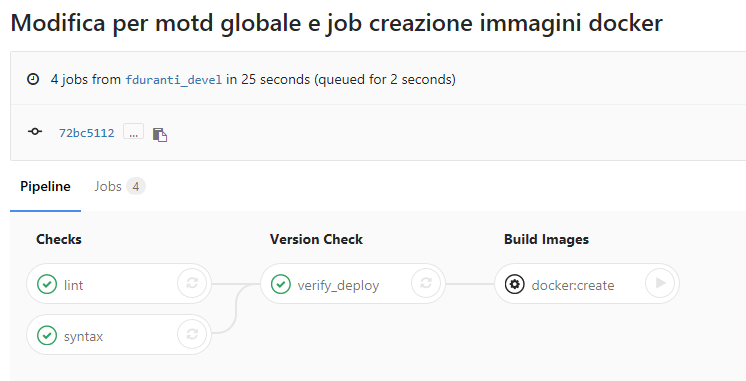
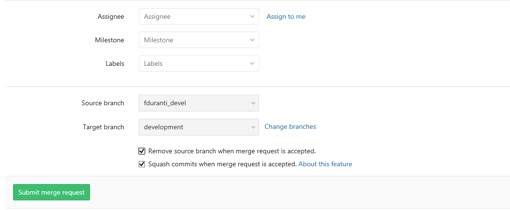
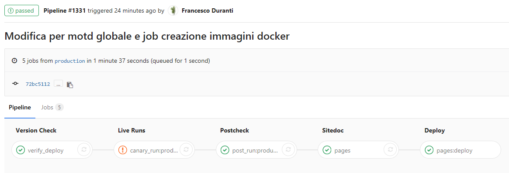
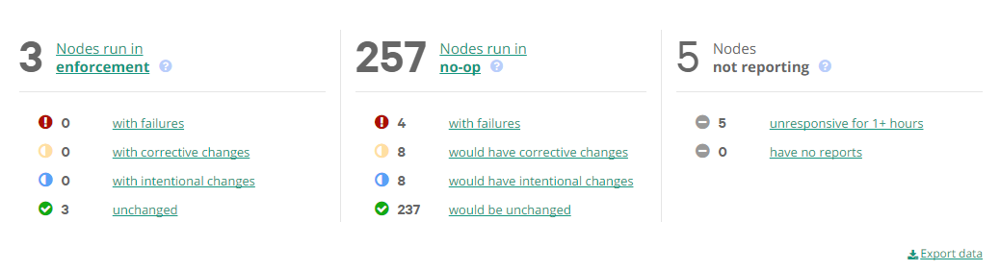

## Puppet change process

In this document we will review the process to follow to manage Puppet changes.

By Puppet changes we mean, any modification, addition or deletion in this Git repository which may involve changes on real server, once the change has been deployed to the Puppet Server.

### Changes overview: summary of involved files and impact

This repository contains various files and directories, changing their contents may or may not affect our servers in different ways. We identify the following risks level, from lower to higher:

  - [safe] - Changes done here are totally safe in terms of impact on running servers
  - [bau] - Business as usual. Changes here impact a limited number of servers or not critical elements
  - [warning] - Changes may impact several servers and should be considered with care
  - [danger] - Changes may have a very large impact. Be sure to be aware of what we are doing

Let's have a quick overview of the risk level related to different kind of files. Needless to say that they refer to actual changes in Puppet code and data, if we are just adding a comment we can be confident that we change won't have any effect.

  - [safe] ```README.md```, ```docs/```, ```LICENSE``` contain documentation and general information. Changes done here won't have any impact on our servers

  - [danger] ```hiera.yaml``` is the Hiera configuration file for the environment, changes here (for in the hierarchy or the used backends) may affect several systems in more or less unpredictable ways. Edit it only if we know what we are doing.

  - [danger] ```data/common.yaml```, ```data/defaults.yaml```, ```data/location/``` contain Hiera data which is used for all the nodes or the ones of a specific location (when not overridden in more specific layers of the hierarchy), so any change here may impact several servers. Be aware.

  - [warning] ```data/role/``` contains Hiera data which is used for all the nodes of the same role. These might be a few or several, according to the role. Edit with care, always considering if it's safe to rollout our change to all the nodes with this role

  - [bau] ```data/nodes/``` contains Hiera data for specific nodes. Here we can place nodes specific settings, which are easy to test (directly on the involved node) and have a limited impact (only the node having the name of the file we change).

  - [danger] ```manifests/``` files here impact all the nodes. Handle with care.

  - [warning] ```Puppetfile``` contains the list of the modules to add to the control-repo. If we add a new module we won't have any effect on nodes until we actually start to use its classes or defines. If we remove a module we'll break Puppet runs in all the nodes that eventually use it. When we add or remove modules, we may see on our nodes files changing at the first Puppet run: these are due the contents of module's plugins being synced to the clients (pluginsync feature) they are normal and won't affect our servers operations.

  - [warning] ```bin/```, ```docker/```, ```vagrant/```, ```fabfile```, ```.gitlab-ci.yml``` contain scripts, configurations and settings which won't affect directly our servers but may break our CI pipelines or testing environments. Handle with relative care.

  - [danger] ```site/tools/```, ```site/profiles/manifests/base*``` these are local site defines and classes which may be used by a wide number of nodes. Handle with care.

  - [warning] ```site/profiles/*``` here we change Puppet code which may affect one or more nodes.

Don't be too much worried about the above dangers and warnings, though, it's normal in the life of Puppet admin to edit such files, just be aware of the potential impact area of our change and, always, do changes we are aware of and, when we are not fully sure of what we are doing, test our changes in noop mode before actually enforcing them.

### Change process

Each non trivial change on this git repository should follow a workflow as the one outlined here. We will mark with the label **[trivial skip]** the steps than can be skipped for trivial changes.

An express path might be considered for very urgent changes, such as fixes for current outages or for very urgent user requests. We will mark with the label **[express skip]** the steps which might be skipped in such cases.

##### 1 - USER: Open a ticket [trivial skip] [express skip]

Normally every change should be tracked by a relevant ticket on the Ticketing System of choice. This should be done by the user requesting the change (only as exception operators should open tickets by themselves for requests arrived by email, voice or other means). Ticket title should be informative and not generic and in the description should be added details such as:

  - What has to be changed (content of a file, user password, package installation ...) and how
  - Where the change should occur (a specific server, all servers or a role/datacenter/environment...)
  - If the change should be applied at specific times or conditions (changing a file may involve a service restart, is this supposed to be done only in maintenance windows?)
  - If the request is for fixing a malfunctioning system, any detail on the kind of failure and eventually suggested solutions


##### 2 - PUPPET TEAM: Prioritize and assign tickets [trivial skip] [express skip]

Ideally is not the user who decides who has to fix his problem, but the team of Puppet admins. Prioritization and assignment should be handled directly on the Ticketing System. Decisions on them can be done by the team leader, by the whole team in regular meetings (ie: stand-ups) or autonomously by each member (a Puppet operator self assigns an open ticket and starts to work on it).

Using Kanban boards to map tickets to cards can help the process.

##### 3 - PUPPET DEVELOPER: Development

The assigned team member starts to work on the ticket, he should have a ready to use workstation where he can develop and test his Puppet code. Any change should be pushed to  **development branch only**. The CI process [semi]automatically takes care to promote the change to **testing** and **production** branches.

A good approach is to create a feature branch, with the relevant name and relevant ticket number. Once the changes on the feature branch have been merged into development, and then up to production, and the relevant ticket closed, the feature branch should be removed.

Remember to always create a feature branch based on current status of development branch. First we have to checkout into development branch:

    git checkout development

Then it's always recommended to sync the local branch to origin so that we are sure we are working on updated code:

    git pull origin development

Then we can create a new branch with the name referring to the relevant ticket:

    git checkout -b feature_22

Finally we can start to edit our files and make our developments:

    vi ....


##### 4 - PUPPET DEVELOPER: Testing [trivial skip] [express skip]

We have at disposal several ways to test our Puppet code:

  - We can test our changes on our local development workstation, using the available [vagrant](vagrant.md) environments (this can be done before any commit)

  - We can test our changes on real servers, using our feature branch

For this second approach, and in any case when we want to publish our changes, we have to commit and push our feature branch. First add files to the stage, ready to be committed:

    git add <changed/file[s]>

Then, make a commit, in its description of our commit, always add the reference to the relevant the ticket number, using the syntax: #<number>:

    git commit -m "Description #22"   

Finally push our local changes to the central git server:

    git push origin feature_22

Once we push to a branch on GitLab the same branch is automatically deployed as Puppet environment on the Puppet Server, so, in our example, we'll have a new Puppet environment called "feature_22".

In order to be able to use a custom environment on a node, we first need to be sure that this node belongs, on Puppet Enterprise console, to the node group "Agent-Specified environment" as in the following picture


We can then test our environment, either directly from the managed node, as root. The first attempt should be done in noop mode to see what changes would be applied (NOTE: If servers run in noop mode by default, we don't need to specify it):

    puppet agent -t --environment=feature_22 --noop

Then we can run Puppet in real mode, using our environment. The --no-noop option is needed only if by default our node runs in noop mode:

    puppet agent -t --environment=feature_22 --no-noop


Whenever we push changes to a feature branch, a set of basic syntax tests is automatically triggered by GitLab CI. We can check their status looking at the relevant pipeline, which looks like:



In this scenario we optionally can test our code on docker images.


##### Simplified Alternative using development branch

For trivial or express cases we might decide to skip the creation of a feature branch and make our changes directly on the development branch.

In such a case the git workflow would be slightly simplified:

    git checkout development
    git pull origin development
    vi .... [Edit files and eventually test them locally via Vagrant]
    git add <changed/file[s]>
    git commit -m "Description #22"
    git push origin development


##### Simplified Alternative using web interface

An even simpler and more direct approach is to use directly the web interface of GitLab (or any other online or local system used for git repos management) to edit the needed files.

  - Click on the file that has to be changed
  - Click on **Edit**
  - Make the desired changes from the web interface
  - Click on **Save** to commit your changes (a commit title and description can be added)

Such an approach should be followed only in these cases:

  - We have just to edit a single file
  - We are not proficient with git and its usage from the command line
  - Change is trivial or we are in an extreme hurry

Note that such an approach prevents us from testing our code on Vagrant, but still allows us to test it on real servers, using the environment matching the branch we have worked on.


##### 5 - PUPPET DEVELOPER: Merge Request [trivial skip] [express skip]

Once we're satisfied with our change, we can submit, from GitLab web interface, a **Merge Request** from our feature branch to the **development** branch as in the following picture:



We can accept the merge request immediately, and this automatically starts a new pipeline and deploys our changes to the Puppet development environment.

The pipeline looks as in the following picture:


here besides the common syntax and lint checks, are done some additional checks:

  - A catalog diff on nodes which might be involved by the change. Here we can see how the catalog of the resources appliead to a node changes, with our commits, compared to the current status in production (note: sometimes changes are intended and wanted, but here we can evaluate if such changes affect also nodes where there should not be any change)

  - Checks on multiple OS Docker images are also done, here we can evaluate what our changes do on a node when Puppet runs

If all checks in development pass (note some of them are optional and could be configured to pass even in case of warnings/failures) then an automatic Merge Request is done from development to testing branch.

The Merge Request (done in fast-forward mode: no new commit is introduced in the repo history) is automatically accepted and the change is promoted to testing, where another CI pipeline starts. It looks as this:


In this pipeline real Puppet runs are done on real servers (so called canary nodes, if something has to go wrong, they are supposed to be the first ones to "notice").

At the end of this pipeline, if no blocking errors are found, an automatic Merge Request is done from testing to production branch. In this case we have to manually accept it, either clicking on the relevant button in the pipeline, or from the Merge Requests page, where we can eventually add comments or notes.

NOTE: If we have added the reference to a ticket (ie: #22) in our commit title, the same ticket is automatically closed when the commit is merged to production. In case we don't want this (because our commit actually didn't completely accomplished whatever was requested in the ticket), we'll have to manually re-open the ticket.


##### 6 - PUPPET DEVELOPER: Production rollout

Once our change is pushed to the production branch, it's automatically deployed as Puppet production environment on our Puppet server.



Most of the nodes run by default in noop mode, and check for Puppet changes every 30 minutes, so our changes are not going to be applied automatically, we have to use Rundeck (or run puppet from the command line with the --no-noop option) to propagate and apply changes for real.

First login to [Rundeck](http://itromrundeck.q8int.com) and select the Puppet project from the available ones:


From the Puppet project we can see the available jobs:


Select the "Execute Puppet Agent command", here we have a window where we can choose if to run Puppet in noop mode or not: we have to set noop to false if we want to trigger a real Puppet run.

We can also select the nodes on which to run Puppet and the classes to apply (normally all the classes expected on a node are applied)


For each job we can see the output of the Puppet run and the exit status.


It's always a good idea to keep an eye on the Puppet Enteprise console and see the status of the nodes in our infrastructure:



In the above picture we can see that we have 3 nodes where Puppet is always running "for real", and 257 nodes configured in Noop mode: here Puppet runs but does not make any change.

In the same screen we can see the number of nodes where Puppet has run with some failures, the ones where Puppet re-established a configuration in its expected state ("corrective changes", here they might have been manual changes since the previous Puppet run which have been reverted by Puppet)  and the ones where Puppet make intentional changes, as the ones we can see when we modify our code or data in order to modify some system's resource.
